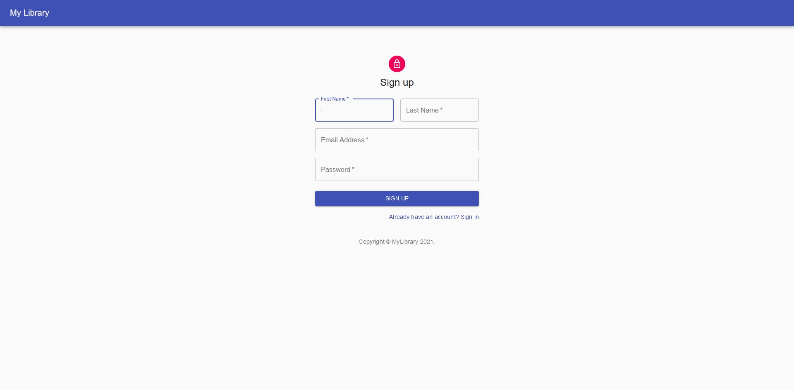

<div align="center"><h1>MyLibrary</h1></div>
<div align="center"><h3>Keep track of your reading list</h3></div>


<pre><div align="center">     </div></pre> 

# Table of Content:
- [Features](#features)
- [Display Shots](#display-shots)
- [Running the project](#running-the-project)


## Features
- ✅ Signup/Login using email and password
- ✅ Signup/Login using Google auth
- ✅ Add books to your reading list
- ✅ Update books status from read to unread or unread to read
- ✅ Delete books from your reading list
- ✅ Get random book recommendation
- 🚧 Efficient error handling
- 🚧 Progress buttons for async events to give users feedback


## Display Shots
 <pre align="center">Login page, generates random pic everytime</pre>
<div align="center"></div><br/>
 <pre align="center">Signup page</pre>
 <div align="center">  </div> <br/>  
  <pre align="center">Home page: Add,delete and update book records</pre>
 <div align="center">     </div><br/> 
 <pre align="center">Random Book recommendation</pre>
 <div align="center">    </div><br/> 

## Running the project
1. Make Firebase project
```
https://firebase.google.com/docs/web/setup
```
2. Add Firebase config object to firebase/config.js file and export it. 
3. Run npm i
4. Run npm start


